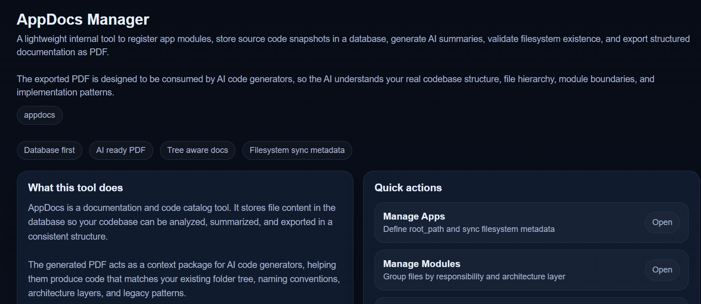

---


# App Content Manager

PHP MySQL

## Overview

App Content Manager is an internal documentation and code snapshot tool built with PHP and MySQL.
It stores application source code in a database and generates print friendly documentation that can be exported as PDF.

The exported PDF is intentionally designed to be consumed by AI code generators so the AI can understand your real codebase structure, module boundaries, and implementation patterns.

This tool is especially useful for large codebases, legacy systems, monorepos, and multi application environments.

---

## Primary Goals

* Centralize application documentation
* Preserve code snapshots without touching physical files
* Provide structured context for AI code generators
* Reduce AI hallucination during code generation
* Improve refactoring accuracy on legacy systems
* Support faster developer onboarding

---

## Key Features

### Application Management

* Create Read Update Delete Apps
* Define application root paths
* Validate file existence in filesystem
* Store file metadata size modification time hash

### Module Management

* Create Read Update Delete Modules per App
* Logical grouping of files by responsibility
* Representation of architecture layers

### Code Content Management

* Create Read Update Delete code content
* Relationship between App Module and File Path
* Store source code in database
* Store AI generated summaries
* View file details

### Browsing and Filtering

* View all stored content
* Filter by App
* Filter by Module
* Useful for audits and code exploration

### Documentation Export

* Export to print friendly HTML
* Save as PDF using browser print
* No third party PDF libraries
* Optimized as AI context document

---

## Data Architecture Concept

* **App**
  Represents a single application or service
  Has a defined root path

* **Module**
  Logical grouping within an App
  Example authentication billing reporting

* **Content**
  File snapshot
  File path title source code summary

All data is stored in the database.
Physical source code files are never modified.

---

## Role of PDF in AI Code Generation

The PDF export acts as an **AI context package**.

The document includes:

* Directory structure
* App Module Content relationships
* Source code snapshots
* AI generated summaries per file

Direct benefits:

* AI understands the codebase tree
* AI follows existing naming conventions
* AI respects architectural patterns
* AI generates more relevant patches
* AI operates more safely on legacy code

The PDF can be uploaded to:

* ChatGPT
* Claude
* Gemini
* Internal AI code generators

---

## Installation

### Requirements

* PHP 7.4 or newer
* MySQL or MariaDB
* Apache or Nginx web server

### Installation Steps

1. Create a MySQL database named `appdocs`
2. Import `schema.sql`
3. Update database credentials in `config/db.php`
4. Place the project folder in your web root
5. Open `public/index.php` in your browser

---

## Project Structure

```
appdocs/
├── config/
│   └── db.php
├── lib/
│   └── helpers.php
├── public/
│   ├── index.php
│   ├── apps.php
│   ├── modules.php
│   ├── contents.php
│   ├── export_pdf.php
│   └── exports.php
├── schema.sql
└── README.md
```

---

## How PDF Export Works

1. Open Export menu
2. Apply filters if needed
3. Print friendly page opens
4. Press Ctrl P
5. Select Save as PDF

The generated PDF is ready to be used as AI context.

---

## Important Notes

* No third party PDF libraries are used
* All exports rely on browser print
* Editing content only updates database records
* No filesystem write operations are performed
* Safe to use on production codebases

---

## Ideal Use Cases

* Internal engineering documentation
* Legacy system migration
* AI assisted refactoring
* AI driven development workflows
* Technical knowledge base

---

## License

Internal use
Adjust as needed for your organization

---
