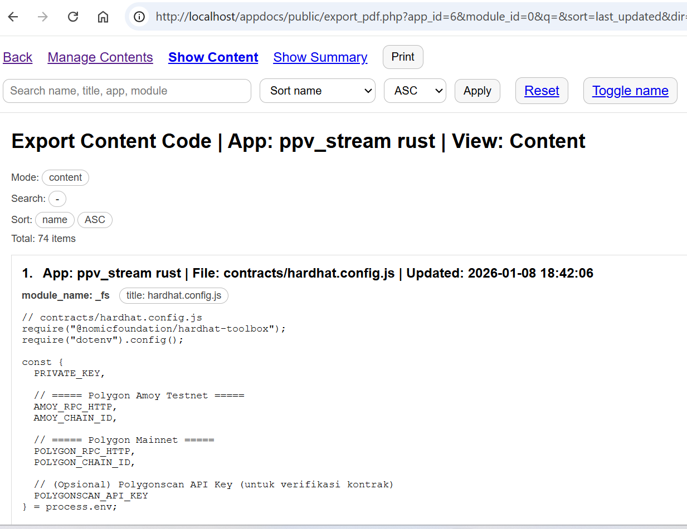

---


# appDocs – (App Content Manager)

PHP MySQL

## Overview

App Content Manager is an internal documentation and code snapshot tool built with PHP and MySQL. It stores application source code in a database and generates print friendly documentation that can be exported as PDF.

The exported PDF is intentionally designed to be consumed by AI code generators so the AI can understand your real codebase structure, module boundaries, and implementation patterns.

This tool is especially useful for large codebases, legacy systems, monorepos, and multi application environments.
---

## How appDocs Works

Simple Documentation That Evolves with Your Code

appDocs is designed so documentation does not interrupt development.
Documentation is created **alongside coding**, not as a separate task.

The workflow is intentionally minimal
you keep coding in your real codebase
appDocs stores selected snapshots in the database
PDF documentation can be generated at any time

---

## Core Concept

appDocs is **not a code editor** and **not a version control system**.
It acts as a **documentation snapshot layer** on top of your existing codebase.

What appDocs stores
source code snapshots
file metadata
application and module structure

What appDocs never touches
physical source files
git repositories
deployment environments

---

## Step by Step Workflow

### 1. Code as Usual

Developers continue working in their IDE and repository.
No workflow changes are required.

---

### 2. Copy Physical Code into Snapshot Content

When a file becomes relevant for documentation, refactoring, or AI context, the developer copies the file content from the physical codebase into appDocs.

At this stage
the file content is stored in the database
file path is recorded
the file is linked to an App and Module

Only selected files are documented.
This keeps documentation focused and intentional.

---

### 3. Sync Code Changes

When the physical code changes, developers run the **Sync Code** action.

Sync performs
file existence validation
metadata updates such as size and modification time
change detection indicators

If the file has changed, the developer updates the snapshot by copying the latest version into appDocs.

No filesystem writes occur.
All updates remain database only.

---

### 4. Snapshots Are Always Export Ready

Every stored snapshot instantly becomes part of the documentation set.

No build process
no compilation step
no additional tooling

The documentation state always reflects the current snapshot selection.

---

### 5. Generate PDF Anytime

When needed, appDocs assembles a print friendly documentation view from the snapshot database.

The exported document contains
application and module structure
file listings
source code snapshots
AI generated summaries

PDF generation uses browser print
Ctrl + P
Save as PDF

The result is a static, consistent documentation package ready for AI consumption.

---

## Why This Approach Works

### Documentation Follows Developer Rhythm

Only meaningful files are documented.
No pressure to document everything.

---

### Intentional Snapshots

Snapshots are created consciously by developers, not automatically.

This results in documentation that is
clean
focused
AI friendly

---

### Safe for Any Environment

Because appDocs never modifies physical files, it is safe to use in
local environments
staging systems
production codebases

---

## Workflow Summary

Develop code normally
Copy important files into snapshot content
Run sync to validate changes
Update snapshots when code evolves
Generate PDF whenever needed

---

With this model, documentation becomes a natural byproduct of development.
appDocs turns live coding activity into structured, AI ready documentation without friction.


---

## Primary Goals

* Centralize application documentation
* Preserve code snapshots without touching physical files
* Provide structured context for AI code generators
* Reduce AI hallucination during code generation
* Improve refactoring accuracy on legacy systems
* Support faster developer onboarding

---

## Key Features

### Application Management

* Create Read Update Delete Apps
* Define application root paths
* Validate file existence in filesystem
* Store file metadata size modification time hash

### Module Management

* Create Read Update Delete Modules per App
* Logical grouping of files by responsibility
* Representation of architecture layers

### Code Content Management

* Create Read Update Delete code content
* Relationship between App Module and File Path
* Store source code in database
* Store AI generated summaries
* View file details

### Browsing and Filtering

* View all stored content
* Filter by App
* Filter by Module
* Useful for audits and code exploration

### Documentation Export

* Export to print friendly HTML
* Save as PDF using browser print
* No third party PDF libraries
* Optimized as AI context document

---

## Data Architecture Concept

* **App**
  Represents a single application or service
  Has a defined root path

* **Module**
  Logical grouping within an App
  Example authentication billing reporting

* **Content**
  File snapshot
  File path title source code summary

All data is stored in the database.
Physical source code files are never modified.

---

## Role of PDF in AI Code Generation

The PDF export acts as an **AI context package**.

The document includes:

* Directory structure
* App Module Content relationships
* Source code snapshots
* AI generated summaries per file

Direct benefits:

* AI understands the codebase tree
* AI follows existing naming conventions
* AI respects architectural patterns
* AI generates more relevant patches
* AI operates more safely on legacy code

The PDF can be uploaded to:

* ChatGPT
* Claude
* Gemini
* Internal AI code generators

---

## Installation

### Requirements

* PHP 7.4 or newer
* MySQL or MariaDB
* Apache or Nginx web server

### Installation Steps

1. Create a MySQL database named `appdocs`
2. Import `schema.sql`
3. Update database credentials in `config/db.php`
4. Place the project folder in your web root
5. Open `public/index.php` in your browser

---

## Project Structure

```
appdocs/
├── config/
│   └── db.php
├── lib/
│   └── helpers.php
├── public/
│   ├── index.php
│   ├── apps.php
│   ├── modules.php
│   ├── contents.php
│   ├── export_pdf.php
│   └── exports.php
├── schema.sql
└── README.md
```

---

## How PDF Export Works

1. Open Export menu
2. Apply filters if needed
3. Print friendly page opens
4. Press Ctrl P
5. Select Save as PDF

The generated PDF is ready to be used as AI context.

---

---

---

## Important Notes

* No third party PDF libraries are used
* All exports rely on browser print
* Editing content only updates database records
* No filesystem write operations are performed
* Safe to use on production codebases

---

## Ideal Use Cases

* Internal engineering documentation
* Legacy system migration
* AI assisted refactoring
* AI driven development workflows
* Technical knowledge base

---

## License

Internal use
Adjust as needed for your organization

## Credit

Developed by Kukuh Tripamungkas Wicaksono (Kukuh TW)
[https://www.linkedin.com/in/kukuhtw/](https://www.linkedin.com/in/kukuhtw/)
2025–2026

---
